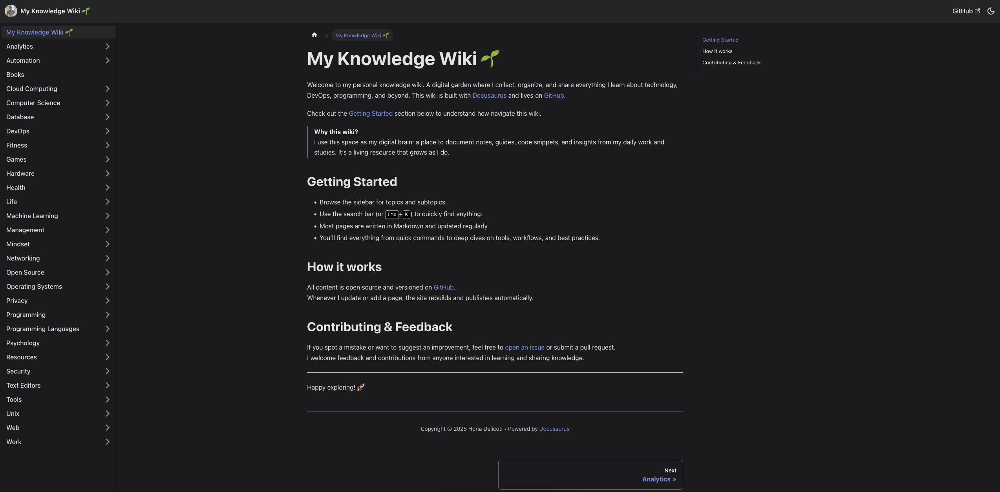

[](https://github.com/horia-delicoti/wiki/actions/workflows/deploy.yml)
[](https://github.com/horia-delicoti/wiki/actions/workflows/release.yml)
[](https://github.com/horia-delicoti/wiki/actions/workflows/tag.yml)
[][mit]
[][docusaurus]

<h1 align="center">📚 My personal Wiki</h1>
<p align="center">
<a href="https://github.com/horia-delicoti/wiki"></a><br>
<i>This repository contains the source code for my personal wiki website.</i>
<br />
<i>A website built with <a href="https://docusaurus.io/">Docusaurus</a></i>
<br />
<b>🔗 <a href="https://wiki.horia.delicoti.com"><code>wiki.horia.delicoti.com</code></a></b>
</p>

## 💡 Motive

A digital garden where I collect, organize, and share everything I learn about technology, DevOps, programming, and beyond.

## 🧠 About

The content is defined in Markdown files located in the [`docs/`](/docs/) directory. The site is built with [Docusaurus][docusaurus] and lives on [GitHub Pages][github_pages].

## 🚀 Getting Started

### ⚙️ Prerequisites

- [Node.js][nodejs_download] (>= 20.x)
- [npm][npm] (comes with Node.js)

### 💻 Installation

Clone the repository:

```sh
git clone https://github.com/horia-delicoti/wiki.git
cd wiki
```

Install dependencies:

```sh
npm install
```

### 🧪 Local Development

<details>
  <summary>Starts the development server</summary>

  [`npm start` → `docusaurus start`](/package.json)

  Features:

  * **Hot Reloading**: Automatically refreshes when you make changes to your source files
  * **Error Overlay**: Displays helpful error messages in the browser when something goes wrong.
  * **Debugging**: Provides detailed stack traces and debugging information.
  * **Faster Build Times**: Optimized for quick feedback during development.

  <i>Use case: When you're actively developing and want to see changes immediately without manually refreshing the browser.</i>

</details>

```sh
npm start
```

### 🏗️ Production Build

<details>
  <summary>Bundles your website into static files for production</summary>

  [`npm run build` → `docusaurus build`](/package.json)

  Features:

  * **Static Site Generation (SSG)**: Pre-renders all pages at build time for optimal performance and SEO
  * **Code Splitting**: Automatically splits JavaScript bundles by routes and components for faster loading
  * **Tree Shaking**: Removes unused code from the final bundle to reduce file sizes
  * **Minification**: Compresses HTML, CSS, and JavaScript files for optimal delivery
  * **Asset Optimization**: Optimizes images and static assets with content hashing for cache busting
  * **Bundle Analysis**: Creates optimized chunks with intelligent caching strategies
  * **Sitemap Generation**: Automatically creates `sitemap.xml` and RSS feeds for search engines
  * **Service Worker**: Generates offline functionality files (if enabled)

  <i>Use case: Preparing your website for deployment with maximum performance optimizations and SEO benefits.</i>

</details>

```sh
npm run build
```

<details>
  <summary>Serves the built website locally.</summary>

  [`npm run serve` → `docusaurus serve`](/package.json)

  Features:

  * Serves the optimized production build of your website.
  * No hot reloading; serves static files as they are. You need to rebuild if you make changes.
  * Production optimizations: Minification, code splitting, and other optimizations for better performance.
  * Exactly what the users will see in production.

  <i>Use case: Testing your production build locally before deploying.</i>

</details>

```sh
npm run serve
```

### 🚀 Deployment

<details>
  <summary>Deploys the website to GitHub Pages</summary>

  [`npm run deploy` → `docusaurus deploy`](/package.json)

  Technical Process:

  * **Automated Build**: Automatically runs [`docusaurus build`](/package.json) to generate production files
  * **Git Integration**: Creates or switches to the `gh-pages` branch in your repository
  * **File Deployment**: Pushes the entire [`build/`](/build/) directory contents to the `gh-pages` branch
  * **GitHub Pages Activation**: Automatically configures GitHub Pages to serve from the `gh-pages` branch
  * **Domain Configuration**: Supports custom domains via [`CNAME`](/CNAME) file generation
  * **History Management**: Maintains deployment history and rollback capabilities
  * **CI/CD Compatible**: Works seamlessly with [GitHub Actions][github_actions] and other CI/CD pipelines

  Prerequisites:

  * Repository must be configured with GitHub Pages settings
  * `organizationName` and `projectName` must be set in [`docusaurus.config.js`](docusaurus.config.js)
  * Git remote must be properly configured and authenticated

  <i>Use case: Automated deployment to [GitHub Pages][github_pages] with zero-downtime and built-in rollback support.</i>

</details>

```sh
USE_SSH=true npm run deploy # Deploy using SSH authentication
```

```sh
GIT_USER=<Your GitHub username> npm run deploy # Deploy using HTTPS authentication
```

### 📸 Screenshot

<h3 align="center">🌎 Wiki Preview</h3>
<p align="center"></p>

## 🔧 Troubleshooting

### Port already in use

```sh
# Kill process using port 3000
lsof -ti:3000 | xargs kill -9
```

### Build fails

```sh
# Clear npm cache
npm cache clean --force

# Remove node_modules and reinstall
rm -rf node_modules package-lock.json
npm install
```

### Deployment issues

- Ensure your GitHub repository has Pages enabled
- Check that [`organizationName`](/docusaurus.config.js) and [`projectName`](/docusaurus.config.js) match your GitHub settings
- Verify your authentication method (SSH vs HTTPS)

## 🤝 Contributing

This is a personal knowledge wiki. Feel free to fork the repository and adapt it for your own wiki page. No contributions or issues are needed for this project.

## 🙌 Attributions

![contributors badge][readme-contribs]

## 🫡 Acknowledgements

- [Nikiv Dev's Dev Wiki](https://nikiv.dev/)
- [Paul Copplestone's Knowledge Wiki](https://paul.copplest.one/knowledge/)
- [GitHub Topic: Meta Knowledge](https://github.com/RichardLitt/meta-knowledge?tab=readme-ov-file)
- [Brendex](https://ltkmn.gitbook.io/brendex/)
- [The Blue Book](https://lyz-code.github.io/blue-book/)
- [Today I Learned](https://til.secretgeek.net/)
- [Knowledge Lardissone](https://knowledge-lardissone.vercel.app/#about-me)
- [Mister Micheels' Learning Notes](https://learning-notes.mistermicheels.com/about/about/)
- [Allan MacGregor's Obsidian Publish](https://publish.obsidian.md/allanmacgregor/Meta/Index)
- [Anthony Amar's Personal Wiki](https://anthonyamar.fr/Welcome+in+my+mind+%F0%9F%A7%A0)

## 📚 Resources

### ⚙️ Build & Utility Tools

- [Docusaurus][docusaurus] - An open-source static site generator that makes it easy to build and maintain open source project websites.
- [Node.js][nodejs] - A JavaScript runtime built on Chrome's V8 JavaScript engine.
- [npm][npm] - A package manager for JavaScript.
- [Shields.io][shields] - A service that provides a simple way to create consistent and customizable badges for open source projects.

## ⚖️ License

This project is licensed under the [MIT][mit] License. See the [LICENSE](/LICENSE) file for details.

<!-- License + Copyright -->
<p  align="center">
  <i>© <a href="https://horia.delicoti.com">Horia Delicoti</a> 2025</i><br>
  <i>Licensed under <a href="https://www.tldrlegal.com/license/mit-license">MIT</a></i><br>
  <a href="https://github.com/horia-delicoti"></a><br>
  <sup>Happy exploring 🙂</sup>
</p>

<!-- Links -->
[readme-contribs]: https://readme-contribs.as93.net/contributors/horia-delicoti/wiki
[mit]: https://opensource.org/licenses/MIT
[docusaurus]: https://docusaurus.io/
[nodejs]: https://nodejs.org/en/
[nodejs_download]: https://nodejs.org/en/download
[npm]: https://www.npmjs.com/
[shields]: https://shields.io/
[github_pages]: https://pages.github.com/
[github_actions]: https://github.com/features/actions

<!-- Knowledge Hive -->
<!--
       _______
      /      /,
     /      //
    /______//
   (______(/
     ||  ||
     ||  ||   Projects 🛠️
     ||  ||   Knowledge 📚
     ||  ||   Wiki 📝
-->