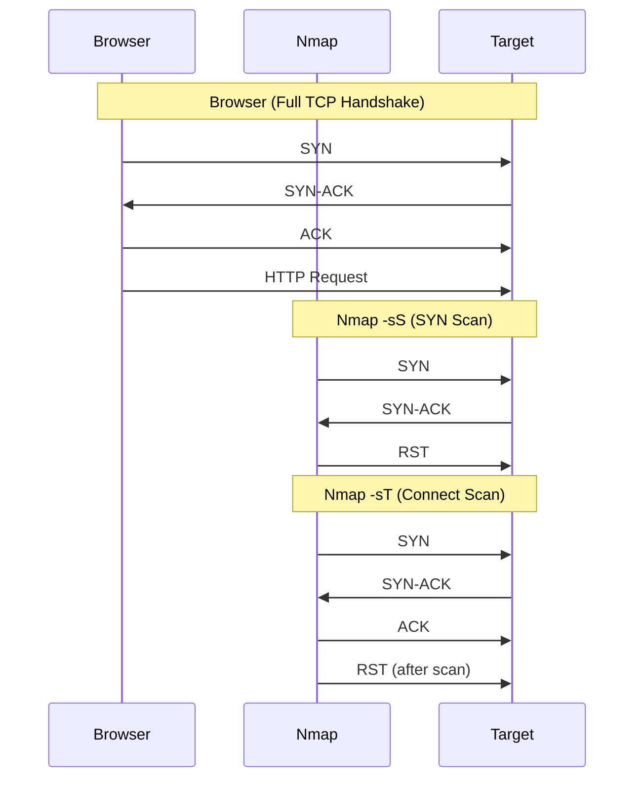

[nmap](https://nmap.org/book/toc.html) (Network Mapper) is an [open-source tool](https://github.com/nmap/nmap) used for network discovery and security auditing. It can be used to discover hosts and services on a computer network, thus creating a "map" of the network.

:::warning
nmap uses **[scripts](https://nmap.org/nsedoc/scripts/)** that are considered intrusive and can cause issues on production systems. Always have permission before scanning networks you do not own.
:::

### Basic Usage

```sh title="Discover live hosts in a network. Use this to quickly find which machines are up"
nmap -sn 10.0.0.0/24
# -sn: Ping scan - disable port scan (useful for active host, network discovery)
```

```sh title="Scan specific ports quickly and 'stealthy'"
nmap -sS -p 22,80,443 <IP>
# -sS: TCP SYN (stealth) scan
# -p : Scan specific ports (22, 80, 443)
```

```sh title="Scan only the top used ports only (fast scan)"
nmap --top-ports 100 -T4 <HOST_IP>
# --top-ports: Scan 100 most common ports
# -T4: Aggressive timing for faster scan
```

```sh title="Scan ALL ports, stealthy and fast"
nmap -p- -sS -T4 <IP>
# -p-: Scan all 65535 ports
# -sS: TCP SYN (stealth) scan
# -T4: Faster scan
```

```sh title="UDP scanning"
nmap -sU -T4 -F <HOST_IP>
# -sU: UDP scan
# -T4: Aggressive timing for faster scan
# -F : Fast mode - Scan fewer ports that the default scan

nmap -sU -sS -p 1-1000 <IP>
# -sU: UDP scan
# -sS: TCP SYN scan
# -p : Scan ports 1-1000
```

```sh
nmap -sS -A -p- -T4 --script=vuln -oN full-scan <IP>
# -sS: TCP SYN (stealth) scan
# -A : Enable OS detection, version detection, script scanning, and traceroute
# -p-: Scan all 65535 ports
# -T4: Aggressive timing for faster scan
# --script=vuln: Run vulnerability detection scripts

nmap -O --osscan-guess <IP>
# -O: OS detection
# --osscan-guess: Guess OS more aggressively

nmap -iL targets.txt -oA scan_results
# -iL targets.txt: Scan list of targets from file
# -oA scan_results: Output in all formats (normal, XML, grepable)

nmap -Pn -sV --top-ports 100 <IP>
# -Pn: Treat all hosts as online (skip host discovery)
# -sV: Service/version detection
# --top-ports 100: Scan top 100 most common ports

nmap -sV -sC -T4 -min-rate 5000 -p- <IP>
# -sV: Service/version detection
# -sC: Run default scripts
# -T4: Aggressive timing for faster scan
# -min-rate 5000: Minimum rate of packets sent per second
# -p-: Scan all ports

```

### Options Summary

Options are case-sensitive. Use `-h` to see the help page. Latest version is available at [nmap.usage.txt](https://svn.nmap.org/nmap/docs/nmap.usage.txt).

```sh title="TARGET SPECIFICATION"
# Can pass hostnames, IP addresses, networks, etc.
# Ex: scanme.nmap.org, microsoft.com/24, 192.168.0.1; 10.0.0-255.1-254
-iL <inputfilename> # Input from list of hosts/networks
-iR <num hosts> # Choose random targets
--exclude <host1[,host2][,host3],...> # Exclude hosts/networks
--excludefile <exclude_file> # Exclude list from file

Example:
nmap 10.10.20.1
nmap scanme.nmap.org # you have permission to scan this host
nmap 10.10.10.1 10.10.10.2 10.10.10.3
nmap 10.10.10.1,2,3 # Scan multiple IPs
nmap 10.10.10.1-50  # Range of IPs
nmap 10.10.10.0/24  # CIDR notation
nmap 10.10.10.0/24 -iR 5 # Randomly choose 5 hosts from the specified network
nmap 192.168.0.0/24 --exclude 192.168.0.2 # Exclude a specific host
```

```sh title="HOST DISCOVERY"
-sP # Ping Scan - disable port scan (useful for host discovery)
-sL # List Scan - simply list targets to scan
-sn # Ping Scan - disable port scan
-Pn # Treat all hosts as online; skip host discovery
--dns-servers # serv1[,serv2],.. Specify custom DNS servers
--system-dns  # Use OS's DNS resolver
--traceroute  # Trace hop path to each host

Example:
nmap -sn -sL -Pn --traceroute --dns-servers 8.8.8.8,1.1.1.1 --system-dns 192.168.1.0/24
```

```sh title="SCAN TYPES"
-sT # TCP Connect scan (default scan)
-sS # TCP SYN scan (stealth scan)
-sA # TCP ACK scan
-sW # TCP Window scan
-sM # TCP Maimon scan
-sU # UDP Scan
-sO # IP protocol scan
-sN/sF/sX # TCP Null, FIN, and Xmas scans used to evade firewalls and packet filters. Microsoft Windows/Cisco devices respond with a RST to any malformed TCP packet
```

```sh title="PORT SPECIFICATION AND SCAN ORDER"
-p- # Scans for all TCP ports ranging from 0-65535
-p <port ranges> # Only scan specified ports: -p22; -p1-65535; -p U:53,111,137,T:21-25,80,139,8080,S:9
-F # Fast mode - Scan fewer ports than the default scan
-r # Scan ports sequentially - don't randomize
--top-ports <number> # Scan <number> most common ports
--exclude-ports <port ranges> # Exclude specified ports from scanning

Example:
nmap -p 22,80,443 192.168.1.10 # Scan only ports 22, 80, and 443 on the target
nmap -p 1-1000 10.0.0.5        # Scan ports 1 through 1000
nmap -p U:53,111,137,T:21-25,80,139,8080 192.168.1.15 # Scan UDP ports 53, 111, 137 and TCP ports 21-25, 80, 139, 8080
```

```sh title="SERVICE VERSION DETECTION"
-sV # Enables service/version detection, what version of the service is running on the port
```

```sh title="SCRIPT SCAN"
-sC # Runs a set list of default scripts
--script-args-file=<filename> # provide NSE script args in a file
--script-trace    # Show all data sent and received
--script-updatedb # Update the script database.

Example:
nmap --script "default,vuln,auth,brute,discovery,exploit" -p 1-1000 <IP>
```

```sh title="OS DETECTION"
-O             # Enable OS detection
--osscan-limit # Limit OS detection to promising targets
--osscan-guess # Guess OS more aggressively
--fuzzy-osscan # Use fuzzy OS detection

Example:
nmap -O --osscan-limit --osscan-guess --fuzzy-osscan 192.168.1.1
```

```sh title="TIMING AND PERFORMANCE"
--max-retries <tries> # Caps number of port scan probe retransmissions.
--host-timeout <time> # Give up on target after this long
--min-rate <number>   # Send packets no slower than <number> per second
--max-rate <number>   # Send packets no faster than <number> per second
--scan-delay/--max-scan-delay <time> # Adjust delay between probes

Example:
nmap -T4 --max-retries 2 --host-timeout 30s --min-rate 1000 --max-rate 5000 <IP>
```

```sh title="FIREWALL/IDS EVASION AND SPOOFING"
-f; --mtu <val> # fragment packets (optionally w/given MTU)
-S <IP_Address> # Spoof source IP address
-e <iface>      # Use specified interface
--badsum        # Send packets with a bogus TCP/UDP/SCTP checksum
--ttl <val>     # Set the IP time-to-live field
-D <decoy1,decoy2,...>        # Decoy scan using specified decoy IPs
--data-length <number>        # Append random data to sent packets
--spoof-mac <mac address>     # Spoof the MAC address of the interface
--proxies <proxy1,proxy2,...> # Use specified proxies for the scan

Example:
nmap -f --mtu 8 -S 192.0.2.123 -e eth0 --badsum 192.168.1.100
nmap -D nmap -D 10.10.10.44,10.10.10.12,10.10.10.15 10.10.10.5
```

```sh title="OUTPUT"
-oN/-oX/-oS/-oG <file> # Output scan
-v # Increase verbosity level (use -vv or more for greater effect)
-d # Increase debugging level (use -dd or more for greater effect)
--reason # Display the reason a port is in a particular state
--open   # Only show open (or possibly open) ports
--iflist # Print host interfaces and routes (for debugging)
--packet-trace # Show all packets sent and received
--append-output # Append to rather than clobber specified output files

Example:
nmap -oN scan_results.txt -oX scan_results.xml -oG scan_results.grepable
```

```sh title="MISCELLANEOUS"
-A # Aggressive Scan. Enables OS detection "-O", version detection "-sV", script scanning "-sC", and traceroute "--traceroute"
-V # Print version number
-h # Print this help summary page.
-d # Increase debugging level (use -dd or more for greater effect)
-v # Increase verbosity level (use -vv, -vvv or more for greater effect)
```

### Ping Sweep

A [ping sweep](https://www.codecademy.com/resources/docs/cybersecurity/nmap/ping-sweep) is a network scanning technique to identify active devices on a network by pinging a range of IP addresses. Compared to other methods, ping sweeps can be harder to detect as it is not as aggressive and can skip regular scan stages, making it more of an advantage. Using `-sn`, nmap disables port scanning and only relies on ICMP echo packets (or [ARP](/networking/#arp) requests for local networks) to check if hosts are up.

```sh
nmap -sn 192.168.1.0/24
or
nmap -sn 192.168.1.1-254
```

### Port States

Nmap [categorizes ports](https://nmap.org/book/man-port-scanning-basics.html) into several states based on the responses received during the scan

| State       | Description |
| ----------- | ----------- |
| Open        | Port is open and accepting connections |
| Closed      | Port is closed, no application is listening on it |
| Filtered    | Port is filtered by a firewall or packet filter, preventing nmap from determining its state |
| Unfiltered  | Port is reachable but nmap cannot determine if it is open or closed |
| Open/Filtered   | Port is either open or filtered, nmap cannot determine which |
| Closed/Filtered | Port is either closed or filtered, nmap cannot determine which |

### Timing Templates

Nmap provides [timing templates](https://nmap.org/book/performance-timing-templates.html) to control the speed and stealthiness of scans. The templates range from 0 (paranoid) to 5 (insane). The default is 3 (normal).

```sh
nmap -T0 <IP> # Paranoid   - Serial, very slow scan
nmap -T1 <IP> # Sneaky     - Slow scan, good for avoiding detection
nmap -T2 <IP> # Polite     - Slows down scan to use less bandwidth and target machine resources
nmap -T3 <IP> # Normal     - Default scan speed
nmap -T4 <IP> # Aggressive - Faster scan, good for most cases
nmap -T5 <IP> # Insane     - Very fast scan, can overwhelm networks and devices
```

### Understanding Network Traffic

A [TCP Connect](/networking/tcp) scan works by performing the three-way handshake (Syn -> Syn-Ack -> Ack) with each target port. Nmap tries to connect to each specified TCP port, and determines whether the port is **OPEN**, **CLOSED**, or **FILTERED** based on the response received.

:::tip [Port Scanning Techniques](https://nmap.org/book/man-port-scanning-techniques.html)
With sudo privileges, users exectues an `-sS` **(SYN scan)**.
Without sudo privileges, users executes an `-sT` **(TCP Connect scan)**.
:::

:::info
**[RFC 9293](https://datatracker.ietf.org/doc/html/rfc9293)** states that: "If the connection is **CLOSED** or doesn’t exists, then a **RST** is sent in response."

- If the connection is **OPEN**, then the target server responds with **SYN-ACK** packet, indicating that is ready to establish a connection.
- If port is **OPEN**, but behind a [firewall](/networking/firewall), the target may not respond at all, or it may respond with an ICMP unreachable message, indicating that the port is filtered.

:::

- **Browser**: When accessing a web page, the browser initiates a full **[TCP](/networking/tcp)** connection to the server. This involves a three-way handshake (SYN, SYN-ACK, ACK) to establish the connection before sending HTTP requests.

- **`nmap -sT`** (**TCP Connect Scan**) - _Default without **`sudo`**_:
  - Uses the full TCP handshake (SYN -> SYN-ACK -> ACK) for each target port
  - This method is more easily detected by loggin systems and firewalls
  - **Slower** than SYN scans because it completes the full handshake

- **`nmap -sS`** (**Stealth Scanning**, TCP **SYN Scan** or "half-open" scan) - Requires **`sudo`**:
  - Sends a SYN packet and expects a SYN-ACK if the port is open, but **never completes** the TCP handshake (sends RST instead of ACK), known as a "half-open" scan
  - Considered **stealthier** than `-sT` because it avoids full connection establishment
  - **Faster** than `-sT` because it does not wait for the full handshake to complete
  - Requires **`root`** priviliges to send **raw packets**
  - ⚠️ **Not invisible!** Modern IDS/IPS (eg. [Snort](https://www.snort.org/), [Suricata](https://suricata.io/), [Zeek](https://zeek.org/)) can still detect SYN scans via:
    - Unfinished handshakes (SYN → SYN-ACK → RST)
    - High-frequency or patterned SYN probes
    - "Low and slow" techniques that still show atypical behavior



_To do: Add Wireshark example of TCP SYN scan and TCP Connect scan._

### NSE Scripts to detect vulnerabilities

Nmap's [NSE (Nmap Scripting Engine)](https://nmap.org/book/nse.html) allows users to use [NSE scripts](https://nmap.org/nsedoc/scripts/) to automate various tasks, such as vulnerability detection, service discovery, automate exploits and more.

| Category    | Description |
| ----------- | ----------- |
| Default   | Run with `-sC`; safe and fast info-gathering |
| Safe      | Won't affect the target, non-intrusive, safe for production |
| Intrusive | Not safe: likely to affect the target, may crash services, heavy scanning |
| Vuln      | Scan for vulnerabilities       |
| Exploit   | Attempt to exploit a vulnerability, known bugs (rare and risky) |
| Auth      | Attempt to bypass authentication for running services (e.g. Log into an FTP server anonymously, brute force, bypass) |
| Brute     | Attempt to bruteforce credentials for running services |
| Discovery | Attempt to query running services for further information about the network (e.g. query an SNMP server, HTTP headers) |

:::info
Use `ls /usr/share/nmap/scripts/` or [NSE scripts](https://nmap.org/nsedoc/scripts/) to explore more targeted scripts based on CTF's scenarios.
:::

```sh title="Aggressive script scan, identify services/version info, output scan to file"
nmap -sC -sV <IP>
# -sC: Run default scripts - https://nmap.org/nsedoc/categories/default.html
# -sV: Probe open ports to determine service/version info
# -oN: Output scan to file
```

```sh title="Use default vuln category scripts agains known services"
# Runs only scripts from category "vuln" which target an active service,
# in this case only vulnerability detection scripts against ports 21, 22, 80 and 443 on the target.
nmap -p 80,443,21,22,445 --script vuln <HOST_IP>
```

```sh title="Try brute force login on exposed FTP service"
nmap -p 21 --script ftp-brute <HOST_IP>
```

```sh title="List web directories and files"
nmap -p 80,443 --script http-enum <HOST_IP>
```

```sh title="Scan for SSL/TLS ciphers for HTTPS services"
nmap -p 443 --script ssl-enum-ciphers <HOST_IP>
```

```sh title="Detect SMB Shares"
nmap --script smb-enum-shares -p 445 <HOST_IP>
```

### References

- [Official Nmap Guide to Network Discovery](https://nmap.org/book/toc.html)
- [Nmap Script Engine (NME) Default scripts](https://nmap.org/nsedoc/categories/default.html)
- [Try Hack Me - Nmap Room](https://tryhackme.com/room/nmap)
- [Try Hack Me - Further Nmap Room](https://tryhackme.com/room/furthernmap)
- [Nmap Cheat Sheet by StationX](https://www.stationx.net/nmap-cheat-sheet/)
- [Nmap scan techniques explained by Record Future](https://www.recordedfuture.com/threat-intelligence-101/tools-and-techniques/nmap-commands)
- [Nmap basics for capture the flag CTF by Sagar Chamling](https://sagarchamling.com/notes/nmap-basic-for-capture-the-flag-ctf/#timing-templates)
- [Nmap by Code Academy](https://www.codecademy.com/resources/docs/cybersecurity/nmap)
- [Getting started with nmap by ittavern](https://ittavern.com/getting-started-with-nmap/)
- [Port Scanning by d00mfist](https://d00mfist.gitbooks.io/ctf/content/port_scanning.html)
- [TryHackMe: Nmap Advanced Port Scans](https://tryhackme.com/room/nmap03)

### Tools

- [nmap Automator](https://github.com/21y4d/nmapAutomator) - This script is to automate the process of enumeration and scanning with nmap.
