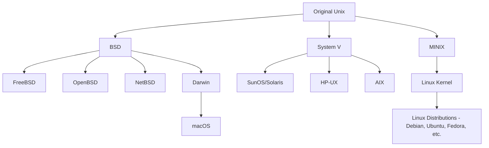

[Unix](http://en.wikipedia.org/wiki/Unix) is a family of multitasking, multiuser operating systems that originated in the 1970s at Bell Labs. Known for its stability, portability, and modular design, Unix has influenced many modern operating systems, including Linux, BSD, and macOS.

### History: How Unix Was Created

Unix was created in 1969 by Ken Thompson, Dennis Ritchie, and others at Bell Labs (AT&T). It started as a small, flexible operating system for minicomputers and quickly gained popularity due to its portability (written in C), modularity, and powerful command-line interface.

**Key milestones:**

- **1969:** First version of Unix developed at Bell Labs.
- **1973:** Unix rewritten in C, making it portable to different hardware.
- **Late 1970s–1980s:** Unix spread to universities and research institutions, leading to many variants.

### The Unix Family Tree

Unix’s open design led to the creation of many different flavors (variants), both proprietary and open source. Here’s a simplified family tree:

### How Linux and Other Flavors Are Produced

- **Linux** is not Unix, but is Unix-like. Linus Torvalds created the Linux kernel in 1991, inspired by Unix principles and MINIX (a Unix teaching OS).
- **Linux distributions** (Ubuntu, Fedora, Debian, Arch, etc.) combine the Linux kernel with GNU tools, package managers, and userland utilities to create complete operating systems.
- **BSDs** (FreeBSD, OpenBSD, NetBSD) are direct descendants of the original Unix codebase, focusing on security, performance, and portability.
- **macOS** is based on Darwin, which incorporates code from BSD and NeXTSTEP (itself Unix-based).

### Key Concepts

- **Everything is a file:** Devices, processes, and data are represented as files.
- **Shell:** Command-line interface for interacting with the system (e.g., sh, bash, zsh, ksh).
- **Processes:** Each running program is a process, managed by the kernel.
- **Permissions:** File and directory access is controlled by user/group/other permissions.
- **Pipelines:** Output of one command can be used as input for another using pipes (`|`).
- **Text-based configuration:** System settings are managed through plain text files.

### Useful Links

- [Shell scripts and tools](https://yoshuawuyts.gitbooks.io/knowledge/content/)
- [Test your sysadmin skills](https://github.com/trimstray/test-your-sysadmin-skills)
- [Unix Tutorial for Beginners](https://www.tutorialspoint.com/unix/)
- [The Art of Unix Programming](http://catb.org/~esr/writings/taoup/html/)
- [Unix Philosophy](https://en.wikipedia.org/wiki/Unix_philosophy)
